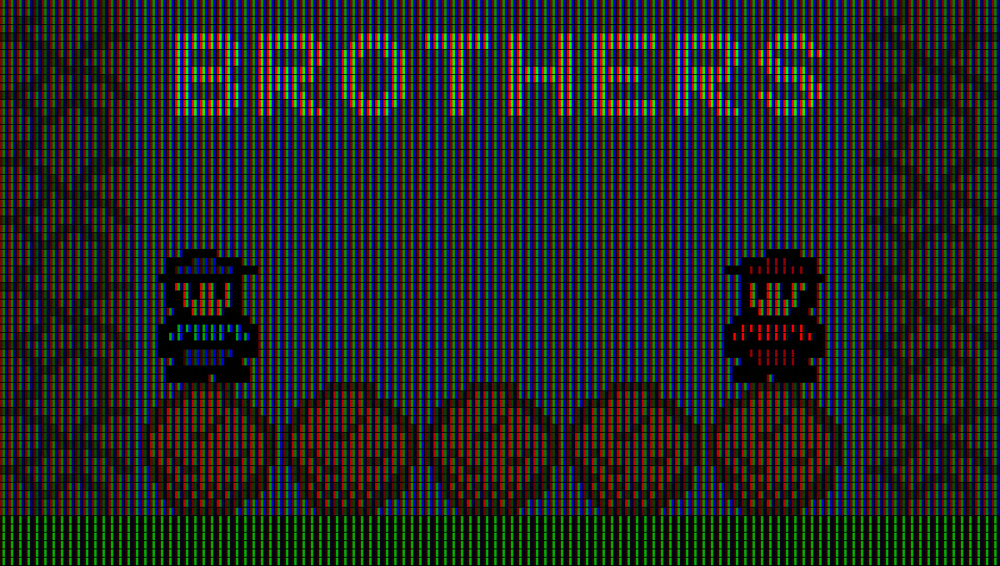

# CRT-Filter
CRT Filter for images and videos.

## Controls
'q' to close de window.

## How to run
To run, install all the dependencies from `requirements.txt`. You can use the following steps.

```py
pip install -r requirements.txt
py scr
```

## Solution Example
Without the filter:


With the filter:
